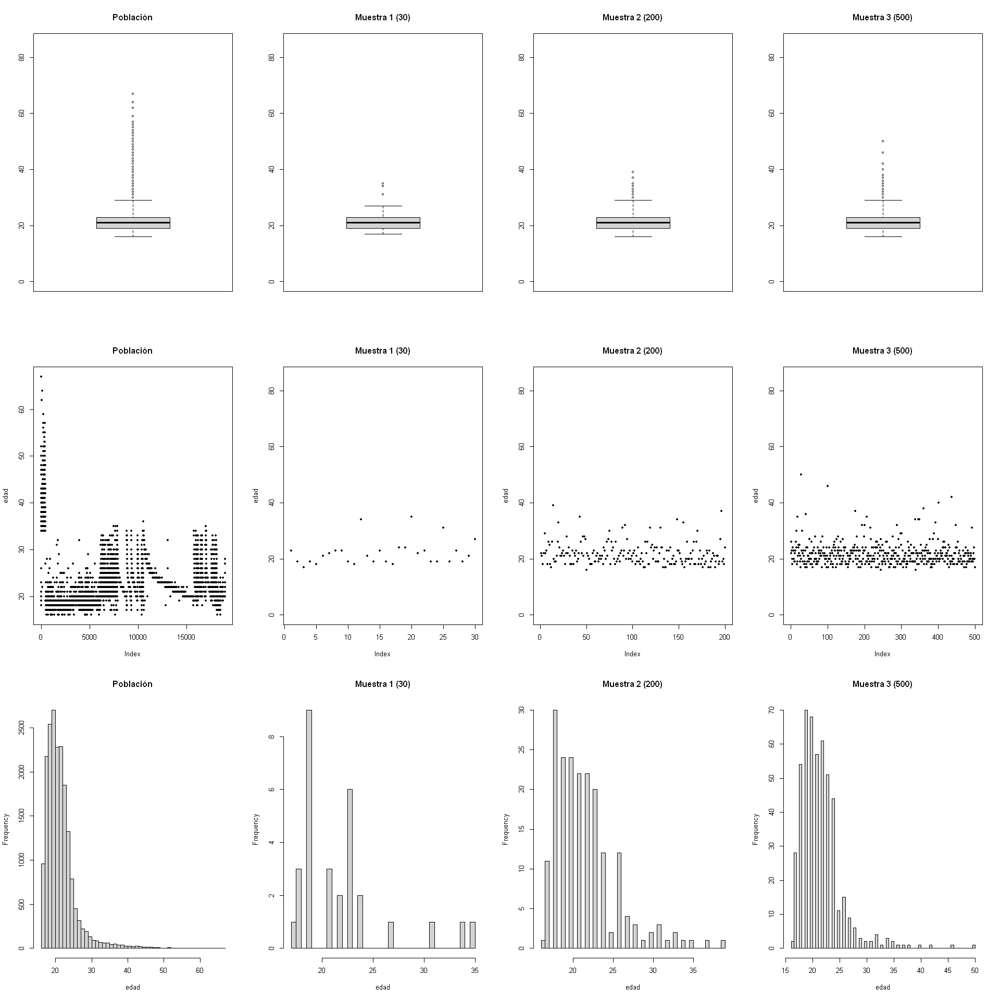

# Ejemplo tipos de muestreo:

Vamos a implementar los distintos tipos de muestreo en una población que generaremos aleatoriamente a partir de una distribución normal $N(\mu,\sigma^{2})$.

Usaremos la función `rnorm`:


```R
args(rnorm)
```


<pre class=language-r><code>function (n, mean = 0, sd = 1) 
NULL</code></pre>


Los argumentos son:
* `n`:  tamaño deseado
*  `mean`: media (por defecto `0`)
* `sd`: desviación estándar (por defecto `1`)

Simularemos una población pequeña ($n=100.000$), con media $\mu=10$ y desviación estándar $\sigma=5$:


```R
x1<-rnorm(100000, mean = 10, sd = 5)
```

Para efectos del ejercicio, necesitamos dos variables categóricas: una que nos permita implementar muestreo estratificado y otra muestreo por conglomerados.

Tenemos varias opciones:

* Creamos un factor complejo mediante la función `gl` y unirlos todos
* Creamos un vector de enteros aleatorios donde cada número represente un nivel de cada variable categórica usando la función `sample`

Para la primera variable categórica vamos a emplear la primera opción:


```R
f1<-gl(3, 11, length=30000)
f2<-gl(2, 5, length=30000)
f3<-gl(3, 7, length=40000)
f<-c(f1,f2,f3)
```

Aquí hemos creado un vector de número enteros (1,2,3) de longitud `100000`, ahora necesitamos convertirlo en factor. Para esto usamos la funcion `factor`:


```R
args(factor)
```


<pre class=language-r><code>function (x = character(), levels, labels = levels, exclude = NA, 
<span style=white-space:pre-wrap>    ordered = is.ordered(x), nmax = NA) </span>
NULL</code></pre>


Los argumentos a tener en cuenta son:

* `x`: vector de datos a transformar
* `levels`: los valores a cambiar
* `labels`: las etiquetas a utilizar

Con lo anterior, y deseando usar los valores `Blanco`, `Negro` y `Rojo`, este factor queda así:


```R
x2<-factor(f, levels = c(1,2,3), labels = c("Blanco","Negro","Rojo"))
```

El siguiente factor lo simularemos con la función `sample`; deseamos crear cuatro niveles y usaremos los puntos cardinales como etiquetas:


```R
fc<-sample(1:4, 100000, replace= T)
x3<-factor(fc, levels = c(1,2,3,4), labels = c("Norte","Sur","Oriente","Occidente"))
```

Finalmente, unimos las tres variables para obtener nuestro `data.frame`:


```R
df<-data.frame(x1,x2,x3)
head(df)
```


<table>
<caption>A data.frame: 6 × 3</caption>
<thead>
	<tr><th scope=col>x1</th><th scope=col>x2</th><th scope=col>x3</th></tr>
	<tr><th scope=col>&lt;dbl&gt;</th><th scope=col>&lt;fct&gt;</th><th scope=col>&lt;fct&gt;</th></tr>
</thead>
<tbody>
	<tr><td>19.126792</td><td>Blanco</td><td>Sur      </td></tr>
	<tr><td> 8.049879</td><td>Blanco</td><td>Norte    </td></tr>
	<tr><td>15.592783</td><td>Blanco</td><td>Occidente</td></tr>
	<tr><td> 8.681098</td><td>Blanco</td><td>Norte    </td></tr>
	<tr><td>13.076240</td><td>Blanco</td><td>Oriente  </td></tr>
	<tr><td>13.859927</td><td>Blanco</td><td>Occidente</td></tr>
</tbody>
</table>


```R
summary(df)
```


           x1               x2                x3       
     Min.   :-12.768   Blanco:38337   Norte    :25017  
     1st Qu.:  6.631   Negro :38334   Sur      :25079  
     Median : 10.015   Rojo  :23329   Oriente  :25088  
     Mean   :  9.995                  Occidente:24816  
     3rd Qu.: 13.349                                   
     Max.   : 32.083                                   


## MAS

Para todos los casos vamos a definir $100$ como el tamaño muestral. Empezando con el _MAS_. Usamos la función `sample` para generar número aleatorios que representan el número de las filas del `data.frame`:


```R
n100<-100 # Para definir el tamaño de la muestra
muestra100<- sample(1:nrow(df),size=n100,replace=FALSE) # replace = F para no repetir números
head(muestra100)
```


<ol class=list-inline>
	<li>27143</li>
	<li>50139</li>
	<li>40501</li>
	<li>8502</li>
	<li>39589</li>
	<li>1195</li>
</ol>


Un `data.frame` tiene dos elementos: `filas` y `columnas` que podemos definir asi:
```
df[filas,columnas]
```
con el objeto `muestra100` hemos determinado las filas que seleccionaremos, por lo tanto usamos esos valores para el elemento filas del `data.frame`:


```R
m100<-df[muestra100,]
summary(m100)
```


           x1               x2             x3    
     Min.   :-0.6068   Blanco:37   Norte    :29  
     1st Qu.: 7.3600   Negro :36   Sur      :25  
     Median : 9.7053   Rojo  :27   Oriente  :23  
     Mean   :10.2645               Occidente:23  
     3rd Qu.:12.7142                             
     Max.   :21.8721                             


## ME

Para el muestreo estratificado necesitamos dos librerías adicionales: `magrittr` y `dplyr`, para usar unas funciones específicas


```R
library(magrittr) # Permite leer la funcion %>% que se usa para asignar funciones a objetos
library(dplyr) # Contiene la funcion select
```

    
    Attaching package: 'dplyr'
    
    The following objects are masked from 'package:stats':
    
        filter, lag
    
    The following objects are masked from 'package:base':
    
        intersect, setdiff, setequal, union
    
    

Requerimos determinar la proporción correspondiente a cada estrato, vamos a usar las siguientes líneas de comando:


```R
Estratos<- df %>%
  select(x2,x1) %>%
  group_by(x2) %>%
  summarise(n=n(),
            s=sd(x1)) %>%
  mutate(p=n/sum(n))

Estratos
```


<table>
<caption>A tibble: 3 × 4</caption>
<thead>
	<tr><th scope=col>x2</th><th scope=col>n</th><th scope=col>s</th><th scope=col>p</th></tr>
	<tr><th scope=col>&lt;fct&gt;</th><th scope=col>&lt;int&gt;</th><th scope=col>&lt;dbl&gt;</th><th scope=col>&lt;dbl&gt;</th></tr>
</thead>
<tbody>
	<tr><td>Blanco</td><td>38337</td><td>5.012791</td><td>0.38337</td></tr>
	<tr><td>Negro </td><td>38334</td><td>4.952705</td><td>0.38334</td></tr>
	<tr><td>Rojo  </td><td>23329</td><td>5.025651</td><td>0.23329</td></tr>
</tbody>
</table>


Teniendo conocimiento de las proporciones, procedemos a determinar las muestras (recordemos que aún no hemos abordado el tema del tamaño muestral):


```R
library('SamplingUtil') # Contiene la funcion nstrata que nos permite calcular los estratos
```


```R
nsizeProp100<-nstrata(n=100,wh=Estratos[,4],method="proportional")
data.frame(x2=Estratos$x2,nsizeProp100)
```


<table>
<caption>A data.frame: 3 × 2</caption>
<thead>
	<tr><th scope=col>x2</th><th scope=col>p</th></tr>
	<tr><th scope=col>&lt;fct&gt;</th><th scope=col>&lt;dbl&gt;</th></tr>
</thead>
<tbody>
	<tr><td>Blanco</td><td>39</td></tr>
	<tr><td>Negro </td><td>39</td></tr>
	<tr><td>Rojo  </td><td>24</td></tr>
</tbody>
</table>


Y procedemos a hacer el MAS dentro de cada estrato:


```R
neBlanco<-39 # Cantidad de sujetos en Blanco
meBlanco100<- sample(1:nrow(df[df$x2=='Blanco',]),size=neBlanco,replace=FALSE)

neNegro<-39 # Cantidad de sujetos en Negro
meNegro100<- sample(1:nrow(df[df$x2=='Negro',]),size=neNegro,replace=FALSE)

neRojo<-24 # Cantidad de sujetos en Rojo
meRojo100<- sample(1:nrow(df[df$x2=='Rojo',]),size=neRojo,replace=FALSE)

mestrato100<-c(meBlanco100,meNegro100,meRojo100) # Unimos los tres vectores

me100<-df[mestrato100,] # Extraemos la muestra

head(me100)
```


<table>
<caption>A data.frame: 6 × 3</caption>
<thead>
	<tr><th></th><th scope=col>x1</th><th scope=col>x2</th><th scope=col>x3</th></tr>
	<tr><th></th><th scope=col>&lt;dbl&gt;</th><th scope=col>&lt;fct&gt;</th><th scope=col>&lt;fct&gt;</th></tr>
</thead>
<tbody>
	<tr><th scope=row>35156</th><td> 7.777611</td><td>Negro </td><td>Oriente  </td></tr>
	<tr><th scope=row>5730</th><td>10.194740</td><td>Negro </td><td>Sur      </td></tr>
	<tr><th scope=row>1999</th><td> 5.682419</td><td>Negro </td><td>Occidente</td></tr>
	<tr><th scope=row>28389</th><td>11.654443</td><td>Blanco</td><td>Occidente</td></tr>
	<tr><th scope=row>32735</th><td>13.493746</td><td>Blanco</td><td>Norte    </td></tr>
	<tr><th scope=row>19673</th><td> 8.954893</td><td>Blanco</td><td>Sur      </td></tr>
</tbody>
</table>


## MS

El muestreo sistemático conlleva a escoger observaciones que ocupan un lugar específico en la lista de datos. Para ellos nos apoyamos en la función `sys.sample` de la librería `SampligUtil`:


```R
library(SamplingUtil)
msis100<- sys.sample(N=nrow(df),n=100)
head(msis100)
```


<ol class=list-inline>
	<li>452</li>
	<li>1452</li>
	<li>2452</li>
	<li>3452</li>
	<li>4452</li>
	<li>5452</li>
</ol>


```R
m100sis<- df[msis100, ]
head(m100sis)
```


<table>
<caption>A data.frame: 6 × 3</caption>
<thead>
	<tr><th></th><th scope=col>x1</th><th scope=col>x2</th><th scope=col>x3</th></tr>
	<tr><th></th><th scope=col>&lt;dbl&gt;</th><th scope=col>&lt;fct&gt;</th><th scope=col>&lt;fct&gt;</th></tr>
</thead>
<tbody>
	<tr><th scope=row>452</th><td> 6.150656</td><td>Rojo  </td><td>Sur    </td></tr>
	<tr><th scope=row>1452</th><td> 6.877552</td><td>Rojo  </td><td>Sur    </td></tr>
	<tr><th scope=row>2452</th><td> 7.650281</td><td>Blanco</td><td>Oriente</td></tr>
	<tr><th scope=row>3452</th><td> 9.382525</td><td>Negro </td><td>Oriente</td></tr>
	<tr><th scope=row>4452</th><td>11.701085</td><td>Rojo  </td><td>Oriente</td></tr>
	<tr><th scope=row>5452</th><td>13.901178</td><td>Blanco</td><td>Norte  </td></tr>
</tbody>
</table>


## MC

El muestreo por conglomerados se realiza de manera similar al muestreo estratificado. La diferencia radica en las características de la variable categórica que debe hacer referencia a un lugar geográfico. En el ejemplo es `x3` que describe los cuatro puntos cardinales. El procedimiento es:


```R
Conglomerados<- df %>%
  select(x3,x1) %>%
  group_by(x3) %>%
  summarise(n=n(),
            s=sd(x1)) %>%
  mutate(p=n/sum(n))

Conglomerados
```


<table>
<caption>A tibble: 4 × 4</caption>
<thead>
	<tr><th scope=col>x3</th><th scope=col>n</th><th scope=col>s</th><th scope=col>p</th></tr>
	<tr><th scope=col>&lt;fct&gt;</th><th scope=col>&lt;int&gt;</th><th scope=col>&lt;dbl&gt;</th><th scope=col>&lt;dbl&gt;</th></tr>
</thead>
<tbody>
	<tr><td>Norte    </td><td>25017</td><td>5.005887</td><td>0.25017</td></tr>
	<tr><td>Sur      </td><td>25079</td><td>5.010662</td><td>0.25079</td></tr>
	<tr><td>Oriente  </td><td>25088</td><td>4.977485</td><td>0.25088</td></tr>
	<tr><td>Occidente</td><td>24816</td><td>4.976974</td><td>0.24816</td></tr>
</tbody>
</table>


```R
nsCProp100<-nstrata(n=100,wh=Conglomerados[,4],method="proportional")
data.frame(x3=Conglomerados$x3,nsCProp100)
```


<table>
<caption>A data.frame: 4 × 2</caption>
<thead>
	<tr><th scope=col>x3</th><th scope=col>p</th></tr>
	<tr><th scope=col>&lt;fct&gt;</th><th scope=col>&lt;dbl&gt;</th></tr>
</thead>
<tbody>
	<tr><td>Norte    </td><td>26</td></tr>
	<tr><td>Sur      </td><td>26</td></tr>
	<tr><td>Oriente  </td><td>26</td></tr>
	<tr><td>Occidente</td><td>25</td></tr>
</tbody>
</table>


```R
nCoNorte<-26
mCoNorte100<- sample(1:nrow(df[df$x3=='Norte',]),size=nCoNorte,replace=FALSE)

nCoSur<-26
mCoSur100<- sample(1:nrow(df[df$x3=='Sur',]),size=nCoSur,replace=FALSE)

nCoOriente<-26
mCoOriente100<- sample(1:nrow(df[df$x3=='Oriente',]),size=nCoOriente,replace=FALSE)

nCoOccidente<-25
mCoOccidente100<- sample(1:nrow(df[df$x3=='Occidente',]),size=nCoOccidente,replace=FALSE)

mCong100<-c(mCoNorte100,mCoSur100,mCoOriente100,mCoOccidente100)
mc100<-df[mCong100,]

head(mc100)
```


<table>
<caption>A data.frame: 6 × 3</caption>
<thead>
	<tr><th></th><th scope=col>x1</th><th scope=col>x2</th><th scope=col>x3</th></tr>
	<tr><th></th><th scope=col>&lt;dbl&gt;</th><th scope=col>&lt;fct&gt;</th><th scope=col>&lt;fct&gt;</th></tr>
</thead>
<tbody>
	<tr><th scope=row>3761</th><td> 8.988457</td><td>Rojo  </td><td>Occidente</td></tr>
	<tr><th scope=row>17802</th><td> 9.913411</td><td>Negro </td><td>Norte    </td></tr>
	<tr><th scope=row>15866</th><td> 8.687524</td><td>Rojo  </td><td>Norte    </td></tr>
	<tr><th scope=row>18550</th><td>11.732728</td><td>Blanco</td><td>Norte    </td></tr>
	<tr><th scope=row>8781</th><td>13.626400</td><td>Blanco</td><td>Sur      </td></tr>
	<tr><th scope=row>10818</th><td> 5.644709</td><td>Rojo  </td><td>Occidente</td></tr>
</tbody>
</table>


Hagamos una comparación gráfica:


```R
par(mfrow=c(2,2))
with(m100, plot(x1, pch=20, main = 'Aleatorio'))
with(me100, plot(x1, pch=20, main = 'Estratificado'))
with(m100sis, plot(x1, pch=20, main = 'Sistematico'))
with(mc100, plot(x1, pch=20, main = 'Conglomerados'))
```





```R
par(mfrow=c(2,2))
with(m100, plot(x2,x1, pch=20, main = 'Aleatorio'))
with(me100, plot(x2,x1, pch=20, main = 'Estradificado'))
with(m100sis, plot(x2,x1, pch=20, main = 'Sistematico'))
with(mc100, plot(x2,x1, pch=20, main = 'Conglomerados'))
```


```R
par(mfrow=c(2,2))
with(m100, plot(x3,x1, pch=20, main = 'Aleatorio'))
with(me100, plot(x3,x1, pch=20, main = 'Estradificado'))
with(m100sis, plot(x3,x1, pch=20, main = 'Sistematico'))
with(mc100, plot(x3,x1, pch=20, main = 'Conglomerados'))
```


```R
par(mfrow=c(2,2))
with(m100, hist(x1, main = 'Aleatorio'))
with(me100, hist(x1, main = 'Estratificado'))
with(m100sis, hist(x1, main = 'Sistematico'))
with(mc100, hist(x1, main = 'Conglomerados'))
```


## EJERCICIO

Pruebe con varios tamaños de muestra, compare los resultados y discútalos con sus compañeros; use las funciones `mystas` Y `summary` para los resultados numéricos

### Función `mystats`:

```
mystats <- function(x, na.omit=FALSE){
  if (na.omit)
    x <- x[!is.na(x)]
  m <- mean(x)
  n <- length(x)
  s <- sd(x)
  skew <- sum((x-m)^3/s^3)/n
  kurt <- sum((x-m)^4/s^4)/n - 3
  return(c('tamaño'=n, 'media'=m, "desviación estándar"=s,
           'simetría'=skew, 'kurtosis'=kurt))
}
```

Simule otra población, esta vez de tamaño $500.000$; construya dos variables de estratos, uno de dos niveles y otros de tres niveles y ua variable de conglomerados para las regiones de Colombia: _Caribe_, _Pacífico_, _Andina_, _Amazonía_ y _Orinoquía_; procure que sea parecida a la realidad nacional. Use los siguientes valores para la media y la desviación estándar de la población a simular:

```
 [1] 1112420.0  991186.8  479001.0  577993.2  772165.4 1045078.5 1232893.1  661851.7 
 [9]  830702.7  819056.6  837199.7  803178.7  828598.7  411176.3  926617.9  705401.8
[17]  843941.3  759118.5 1015989.7  845487.1  965037.1  760726.4 1205077.8  557838.5
[25]  733327.0
```


